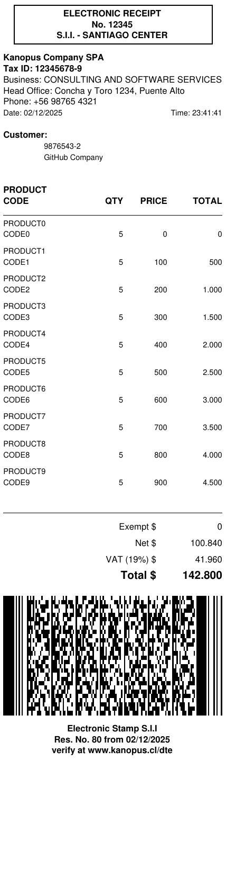

# klib-pdf

This project is designed as a utility that allows you to generate PDF files in an easier way.

## Features

- It allows you to generate PDF in a special 80mm format for thermal printers.
- It allows you to generate PDF in a special 58mm format for thermal printers.
- Allows you to print PDF417 stamp

## 🚀 Installation

Add the dependency to your `pom.xml`:

```xml

<dependency>
	<groupId>cl.kanopus.util</groupId>
	<artifactId>klib-pdf</artifactId>
	<version>3.58.0</version>
</dependency>
```

---

## Usage/Examples

1. Creating a PDF

```java
// Full example based on the test class Receipt80mmPDF
// filepath: src/test/java/cl/kanopus/pdf/thermal/Receipt80mmPDF.java
package cl.kanopus.pdf.thermal;

import cl.kanopus.common.util.Utils;
import cl.kanopus.pdf.DocumentPrinterException;
import cl.kanopus.pdf.FontFamily;
import com.itextpdf.text.BaseColor;

import java.io.ByteArrayOutputStream;
import java.util.Date;

public class Receipt80mmPDF extends AbstractPrint80mm {

    public Receipt80mmPDF() throws DocumentPrinterException {
        super(calcularHeight(10));
    }

    public ByteArrayOutputStream generateOutput() throws Exception {

        //HEADER
        drawRectangle(13, getPositionY() + Space.LOW.size, 180, 35, BaseColor.BLACK, 1);
        println("ELECTRONIC RECEIPT", Align.CENTER);
        println("No. 12345", Align.CENTER);
        println("S.I.I. - SANTIAGO CENTER", Align.CENTER);
        setPositionY(getPositionY() - Space.LOW.size);


        //COMPANY INFO
        setFont(FontFamily.FONT_8_BLACK_BOLD);
        setSpace(Space.LOW);
        println("Kanopus Company SPA");
        println("Tax ID: 12345678-9");

        setFont(FontFamily.FONT_8_BLACK_NORMAL);
        printSplit("Business: CONSULTING AND SOFTWARE SERVICES", 42);
        printSplit("Head Office: Concha y Toro 1234, Puente Alto", 45);
        println("Phone: +56 98765 4321");

        setFont(FontFamily.FONT_7_BLACK_NORMAL);
        print("Date: " + Utils.getDateFormat(new Date()), Align.LEFT);
        println("Time: " + Utils.getTimeFormat(new Date()), Align.RIGHT);
        setPositionY(getPositionY() - Space.LOW.size);

        //RECIPIENT
        setFont(FontFamily.FONT_8_BLACK_BOLD);
        setSpace(Space.LOW);
        println("Customer:");

        setFont(FontFamily.FONT_7_BLACK_NORMAL);
        println("9876543-2", 40);
        println("GitHub Company", 40);

        setPositionY(getPositionY() - Space.LOW.size);

        /*
         * **************** ITEMS ***********************
         * *************************************************
         */
        setPositionY(getPositionY() - Space.LOW.size);
        setFont(FontFamily.FONT_8_BLACK_BOLD);
        setSpace(Space.LOW);
        println("PRODUCT");
        print("CODE");
        print("QTY", getPageWidth() - getMarginRight() - 90, Align.RIGHT);
        print("PRICE", getPageWidth() - getMarginRight() - 50, Align.RIGHT);
        println("TOTAL", Align.RIGHT);

        printLine();
        setFont(FontFamily.FONT_7_BLACK_NORMAL);
        // Now let's loop over the screenings
        for (int i = 0; i < 10; i++) {
            setSpace(Space.LOW);
            println("PRODUCT" + i);
            setSpace(Space.NORMAL);
            print("CODE" + i);
            print(Utils.getNumberFormat(5), getPageWidth() - getMarginRight() - 90, Align.RIGHT);
            print(Utils.getNumberFormat(100 * i), getPageWidth() - getMarginRight() - 50, Align.RIGHT);
            println(Utils.getNumberFormat(5 * 100 * i), Align.RIGHT);
        }


        /*
         * *************** TOTALS SECTION *****************
         * ************************************************
         */
        setFont(FontFamily.FONT_8_BLACK_NORMAL);
        setPositionY(getPositionY() - Space.LOW.size);
        printLine();
        print("Exempt $", getPageWidth() - getMarginRight() - 60, Align.RIGHT);
        println(Utils.getNumberFormat(0), Align.RIGHT);

        print("Net $", getPageWidth() - getMarginRight() - 60, Align.RIGHT);
        println(Utils.getNumberFormat(100840), Align.RIGHT);

        print("VAT (19%) $", getPageWidth() - getMarginRight() - 60, Align.RIGHT);
        println(Utils.getNumberFormat(41960), Align.RIGHT);

        setFont(FontFamily.FONT_10_BLACK_BOLD);
        print("Total $", getPageWidth() - getMarginRight() - 60, Align.RIGHT);
        println(Utils.getNumberFormat(142800), Align.RIGHT);

        /*
         * ************ ELECTRONIC STAMP *****************
         * ***********************************************
         */

        printPdf417("PDF417|TYPE:ELECTRONIC_RECEIPT|NO:12345|TAX_ID:12345678-9|DATE:2025-12-03|TIME:12:00|NET:100840|VAT:41960|TOTAL:142800|VERIFY:www.kanopus.cl/dte");


        setSpace(Space.LOW);
        setFont(FontFamily.FONT_8_BLACK_BOLD);
        println("Electronic Stamp S.I.I", Align.CENTER);
        println("Res. No. 80 from " + Utils.getDateFormat(new Date()), Align.CENTER);
        println("verify at www.kanopus.cl/dte", Align.CENTER);
        println("");
        return super.close();
    }

}
```

You can also run the provided test which generates `test.pdf` in the project root. The resulting sample output is shown
below:



## Authors

- [@pabloandres.diazsaavedra](https://www.linkedin.com/in/pablo-diaz-saavedra-4b7b0522/)

## License

This software is licensed under the Apache License, Version 2.0. See the LICENSE file for details.
I hope you enjoy it.

[](https://opensource.org/license/apache-2-0)

## Support

For support, email soporte@kanopus.cl
